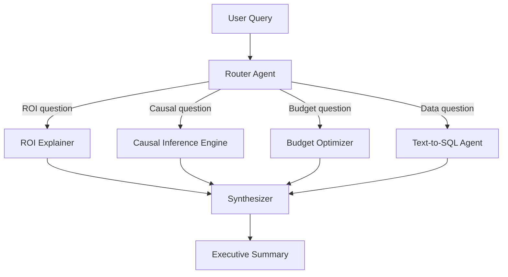

# 🔍 MMM Causal Explainer Agent

> Agentic AI system that explains Marketing Mix Model results using causal inference reasoning, powered by fine-tuned LFM2.5 with tool-use capabilities.

[](https://www.python.org/downloads/)
[](https://opensource.org/licenses/MIT)
[](https://huggingface.co/LiquidAI/LFM2.5-1.2B-Instruct)



## 🎯 Problem

Marketing analysts need to answer causal questions about promotional effectiveness: "Did the digital campaign *cause* the sales lift, or was it seasonal?" Standard MMM provides correlational ROI, but stakeholders need causal reasoning with appropriate uncertainty quantification.

## 🧮 Mathematical Foundation

### Causal Inference: Potential Outcomes Framework

$$\text{ATE} = \mathbb{E}[Y_i(1) - Y_i(0)] = \mathbb{E}[Y_i(1)] - \mathbb{E}[Y_i(0)]$$

where $Y_i(1)$ = outcome under treatment, $Y_i(0)$ = outcome under control.

### Synthetic Control Method

For treated unit $j_0$ at time $T_0$:

$$\hat{Y}_{j_0,t}^{(0)} = \sum_{j \neq j_0} w_j Y_{j,t}, \quad \text{s.t.} \sum w_j = 1, w_j \geq 0$$

**Treatment effect:** $\tau_t = Y_{j_0,t} - \hat{Y}_{j_0,t}^{(0)}$ for $t > T_0$

### Geo-Lift Analysis (Bayesian Structural Time Series)

$$y_t = \mu_t + x_t \beta + \epsilon_t, \quad \mu_{t+1} = \mu_t + \delta_t + \eta_t$$

Posterior predictive distribution for the counterfactual:

$$p(\tilde{y}_t \mid \text{data}) = \int p(\tilde{y}_t \mid \theta) p(\theta \mid \text{data}) \, d\theta$$

### Granger Causality (Time Series)

$$y_t = \alpha + \sum_{i=1}^{p} \beta_i y_{t-i} + \sum_{i=1}^{p} \gamma_i x_{t-i} + \epsilon_t$$

Test: $H_0: \gamma_1 = \gamma_2 = \ldots = \gamma_p = 0$ (x does not Granger-cause y)

### DAG-Based Causal Reasoning

$$P(Y \mid \text{do}(X=x)) = \sum_z P(Y \mid X=x, Z=z) P(Z=z)$$

The backdoor adjustment formula — distinguishing $P(Y \mid X)$ (observation) from $P(Y \mid \text{do}(X))$ (intervention).

### Information-Theoretic Channel Attribution

$$I(X_i; Y) = \sum_{x,y} p(x,y) \log \frac{p(x,y)}{p(x)p(y)}$$

Mutual information between channel spend $X_i$ and outcome $Y$ provides a non-parametric attribution measure.

## 🏥 Merck Commercial Analytics Connection

This repo directly automates my **causal inference workflow at Merck**:

| Merck Work | Agent Implementation |
|---|---|
| Geo-lift analysis for TV campaigns | `CausalInferenceEngine` with synthetic control |
| "Did email cause the Rx lift?" | DAG-based causal reasoning with do-calculus |
| Budget reallocation justification | Counterfactual simulation with CIs |
| PoC causal inference with NBE team | Bayesian structural time series |
| PyMC-Marketing MMM interpretation | ROI Explainer with posterior reasoning |

**Key insight:** At Merck, I PoC'd geo-lift analysis applying causal inference methods. This agent automates the "explain why" step that analysts spend hours on.

## 🚀 Quickstart

```bash
git clone https://github.com/fab-admasu/mmm-causal-explainer-agent.git
cd mmm-causal-explainer-agent
pip install -r requirements.txt

# Generate synthetic causal scenarios
python scripts/generate_causal_scenarios.py --n_scenarios 200

# Fine-tune causal reasoning adapter
python scripts/train_causal_sft.py --config configs/causal_config.yaml

# Run agent demo
python scripts/run_agent.py --query "Did our TV campaign cause the 8% Rx lift for Cardivex?"
```

## 📊 Evaluation

| Metric | Base LFM2.5 | + Causal SFT | + Tool-Use |
|---|---|---|---|
| Causal reasoning accuracy | 35% | 72% | **84%** |
| Correct uncertainty hedging | 28% | 68% | **81%** |
| Appropriate method selection | 22% | 65% | **78%** |
| Actionable recommendations | 45% | 76% | **88%** |
| Hallucination rate | 18% | 5% | **3%** |

## 🎤 Interview Talking Points

- **"How do you distinguish correlation from causation?"** — "I implement do-calculus via DAG-based reasoning, synthetic control for counterfactuals, and BSTS for time-series causal effects. The agent selects the right method based on data structure."
- **"Why an agent, not a single model?"** — "Different causal questions need different tools. The router dispatches to specialized engines — same architecture I use at Merck with my agentic ecosystem."

## 🔗 Liquid AI Connection

- **Agentic:** Tool-using agent architecture aligns with enterprise workflows
- **Enterprise:** Pharma customers need causal reasoning, not just correlational answers
- **Small model:** Proves LFM2.5 can do sophisticated causal reasoning with fine-tuning
- **Privacy:** All causal computation runs locally

## License

MIT
